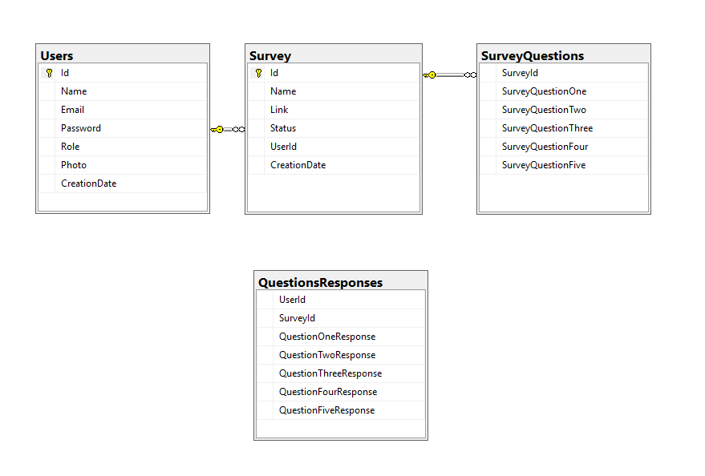

## Tech Stack

* MongoDB
* Mongoose

## What this does
  The backend; takes in the user information from the sign up then uses that same information for the sign in and other CRUD functions, it also is what allows surveys and survey responses to be stored and accessed.

# ERD

# Useful links

- https://github.com/nSyncc/surveyFrontEnd

### Routes

| Verb   | URI Pattern            | Controller#Action |
|--------|------------------------|-------------------|
| POST   | `/sign-up`             | `users#signup`    |
| POST   | `/sign-in`             | `users#signin`    |
| PATCH  | `/change-password/`    | `users#changepw`  |
| DELETE | `/sign-out/`           | `users#signout`   |

## ERD

